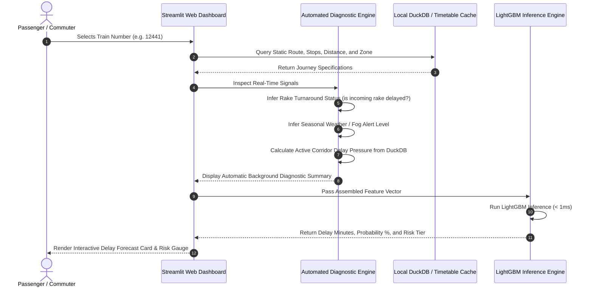

# Architecture and Workflow Specification

## 1. High-Level Architecture

The system is architected as an end-to-end, local-first predictive intelligence platform designed to handle massive tabular transit datasets without cloud storage overhead. It bridges the gap between reactive GPS tracking and proactive network-wide delay cascade forecasting:

```mermaid
flowchart TD
    subgraph Data_Layer ["Data & Storage Layer"]
        A["Raw Historical Dataset: ir_train.csv (1.5M Records)"] -->|Streaming Parallel ETL via Polars| B[("Local DuckDB Warehouse: railway.duckdb")]
        B -->|Indexed Query Engine| C["Journeys Table (45 Attributes)"]
    end

    subgraph Feature_Engineering ["Graph & Cascade Engine"]
        C -->|Zone Adjacency & Corridor Flow| D["16-Zone NetworkX Topological Graph"]
        D -->|Betweenness & Degree Centrality| E["Topological Chokepoint Scores"]
        C -->|Rake Turnaround Tracking| F["Sequential Rake Delay Accumulator"]
        C -->|Rolling 20-Period Window| G["Zone Delay Congestion Pressure"]
    end

    subgraph AI_Modeling ["Scientific Machine Learning Layer"]
        E & F & G --> H["Enriched Feature Matrix"]
        H -->|Multi-Model Benchmark| I{"Model Comparison"}
        I -.->|Evaluated Baselines| J["Ridge Regression & Random Forest & XGBoost"]
        I -->|Champion Model (AUC: 0.9195, MAE: 33.9m)| K["LightGBM Regressor & Classifier"]
        K -->|Model Bundle Serialization| L["champion_models.pkl"]
    end

    subgraph Presentation ["Dual-Mode Presentation Layer"]
        L & B --> M["Streamlit Interactive Dashboard: app/dashboard.py"]
        M --> N["View A: Passenger View - Zero Questions, 100% Inferred"]
        M --> O["View B: Evaluator View - Manual What-If Overrides"]
        M --> P["Tab 2: Network Bottleneck Map"]
        M --> Q["Tab 3: Scientific Benchmark & Ablation"]
        M --> R["Tab 4: Rake Cascade Simulator"]
    end
```

---

## 2. Layer Specifications

### A. Data & Storage Layer
* **Polars Ingestion Engine (`src/etl.py`)**:
  * Utilizes Rust-backed parallel scanning (`pl.scan_csv`) to parse 1.5 million records across 45 columns in **14.41 seconds**.
  * Handles missing data imputation and casts date/categorical types.
* **DuckDB Local Warehouse (`db/railway.duckdb`)**:
  * Serverless, columnar SQL engine storing the cleaned `journeys` table.
  * Optimized with four analytical indexes:
    1. `idx_train_num` (`train_number`)
    2. `idx_zone` (`zone_abbr`)
    3. `idx_dep_date` (`departure_date`)
    4. `idx_hdn` (`is_hdn_route`)
  * Enables sub-millisecond aggregations across 1.5 million rows.

### B. Graph & Cascade Feature Engine
* **Zone Topology Graph (`src/graph_builder.py`)**:
  * Models India's 16 railway zones as nodes and High-Density Network (HDN) connecting corridors (Golden Quadrilateral & diagonals) as 25 directed/undirected edges using **NetworkX**.
  * Computes **Betweenness Centrality** to quantify structural network chokepoints.
* **Cascade Feature Derivation (`src/cascade_features.py`)**:
  * **`rake_cascade_chain_length`**: Cumulative count of consecutive delayed turnaround services sharing the same physical trainset.
  * **`zone_delay_pressure`**: Rolling 20-period average delay per zone, reflecting active regional congestion spillover.
  * **`corridor_betweenness_centrality`**: Topological importance score mapped to each train's operating zone.

### C. Predictive Machine Learning Layer
* **Dual-Model Inference (`src/predictor.py`)**:
  * **Continuous Delay Regressor (LightGBM)**: Predicts expected arrival delay in minutes.
  * **Delay Probability Classifier (LightGBM)**: Predicts probability of exceeding the official IRCTC 15-minute delay threshold.
  * **Risk Stratification**:
    * `< 15 mins`: Low (On-Time)
    * `15 - 45 mins`: Moderate Delay
    * `45 - 90 mins`: High Cascade Risk
    * `> 90 mins`: Severe Gridlock

### D. Zero-Effort Presentation Layer (`app/dashboard.py`)
* **Passenger / Commuter View**:
  * **Zero Technical Questions**: The user only selects a **Train Number**.
  * **Automatic Background Intelligence**: The system automatically looks up timetable specs, queries the incoming trainset's turnaround status (`late_incoming_rake`), evaluates active seasonal weather risk, and queries DuckDB for rolling zone congestion pressure.
* **Evaluator / What-If View**:
  * Allows panel evaluators and mentors to manually override operational parameters to inspect edge cases.

---

## 3. Real-World Production Workflow vs. PoC Architecture


