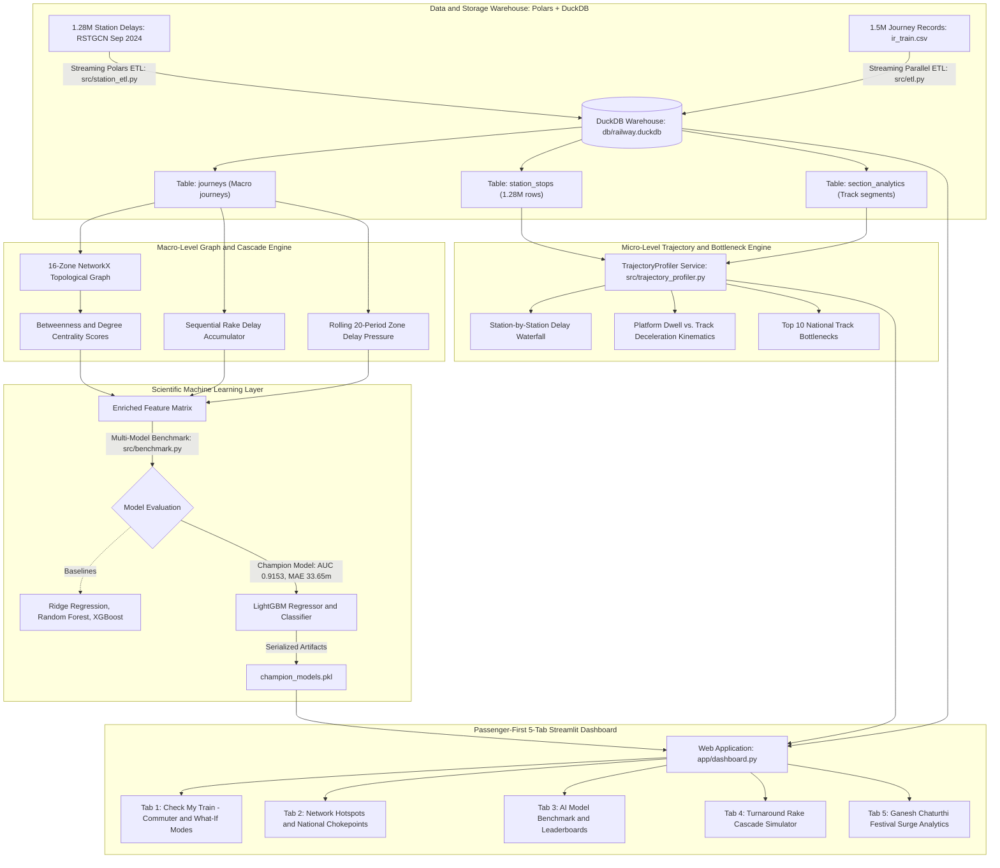
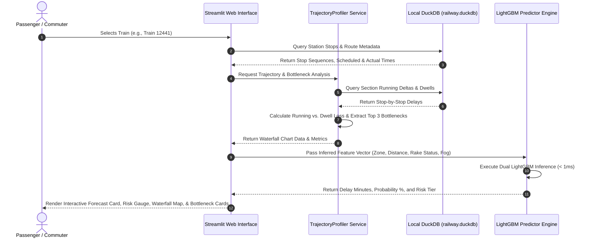

# Architecture and Workflow Specification

## 1. High-Level System Architecture

The platform operates as a dual-granularity, local-first predictive intelligence architecture designed to handle massive spatio-temporal transit telemetry without cloud database overhead. It bridges the gap between linear GPS tracking and proactive network-wide delay cascade forecasting:

---

## 2. Multi-Layer Technical Specification

### A. Data Warehouse & Storage Layer (`src/station_etl.py` & `src/etl.py`)
* **Streaming Polars Ingestion Engine**:
  * Utilizes Rust-backed multithreaded readers (`pl.read_csv` and `pl.scan_csv`) to parse 1.28 million station stop records and 1.5 million journey records in seconds with zero memory leaks.
  * Joins scheduled route sequences with actual arrival/departure telemetry.
* **DuckDB Local Columnar Database (`db/railway.duckdb`)**:
  * **`station_stops` Table**: Stores 1.28M rows of stop-by-stop telemetry:
    * `train_number`, `journey_date`, `stop_sequence`, `station_code`, `station_name`, `zone_abbr`
    * `sch_arr_time`, `act_arr_time`, `arr_delay_mins`, `sch_dep_time`, `act_dep_time`, `dep_delay_mins`
    * Kinematic Section Running Delta:
      $$\Delta_{\text{running}} = \text{arr\_delay}_i - \text{dep\_delay}_{i-1}$$
    * Kinematic Platform Dwell Delta:
      $$\Delta_{\text{dwell}} = \text{dep\_delay}_i - \text{arr\_delay}_i$$
    * Section Distance:
      $$\Delta_{\text{distance}} = \text{cumulative\_distance}_i - \text{cumulative\_distance}_{i-1}$$
  * **`section_analytics` Table**: Aggregated station-to-station corridor statistics (average minutes lost, delay gradient per 100km, delay frequency percentage).
  * **`journeys` Table**: Aggregated 1.5M journey-level records with operational cascade features.
  * **Database Indexing**:
    * `idx_stops_train`, `idx_stops_date`, `idx_stops_stn`, `idx_sec_from_to`, `idx_j_train`, `idx_j_zone`.

---

### B. Micro-Level Trajectory & Kinematic Localization (`src/trajectory_profiler.py`)
* **TrajectoryProfiler Service**:
  * **Waterfall Profiling**: Reconstructs the complete station-by-station trajectory for any train journey.
  * **Root-Cause Kinematics**:
    * Separates total journey delay into **Track Deceleration Loss** (running delta > 0) vs. **Platform Dwell Loss** (dwell delta > 0) vs. **Buffer Slack Recovery** (running delta < -2 min).
  * **Worst Bottleneck Localization**: Automatically flags the top 3 worst delay-inducing track segments along any route.
  * **National Chokepoint Extraction**: Identifies the top nationwide track sections where trains chronically lose time across all observed runs.

---

### C. Macro-Level Graph & Cascade Feature Engine (`src/graph_builder.py` & `src/cascade_features.py`)
* **Zone Topology Graph**:
  * Models India's 16 railway zones as nodes and High-Density Network (HDN) connecting corridors (Golden Quadrilateral & diagonals) as 25 directed/undirected edges using **NetworkX**.
  * Computes **Betweenness Centrality** to quantify structural network chokepoints.
* **Cascade Feature Derivation**:
  * **`rake_cascade_chain_length`**: Cumulative count of consecutive delayed turnaround services sharing the same physical trainset.
  * **`zone_delay_pressure`**: Rolling 20-period average delay per zone, reflecting active regional congestion spillover.
  * **`corridor_betweenness_centrality`**: Topological importance score mapped to each train's operating zone.

---

### D. Predictive Machine Learning Layer (`src/predictor.py` & `src/train.py`)
* **Dual-Model Inference**:
  * **Continuous Delay Regressor (LightGBM)**: Predicts expected arrival delay in minutes ($\text{MAE} = 33.65\text{ mins}$, $\text{RMSE} = 45.76$).
  * **Delay Probability Classifier (LightGBM)**: Predicts probability of exceeding the official IRCTC 15-minute delay threshold ($\text{AUC-ROC} = 0.9153$).
  * **Risk Stratification**:
    * `< 15 mins`: Low Risk (On-Time / Minor Slack)
    * `15 - 45 mins`: Medium Risk (Moderate Delay)
    * `> 45 mins`: High Risk (Significant Cascade Gridlock)

---

### E. Passenger-First Presentation Layer (`app/dashboard.py`)
* **Tab 1: 🎯 Check My Train**:
  * **Commuter Mode (Zero-Effort Default)**: User simply selects a Train Number. The system automatically populates route specs, detects incoming rake status, checks seasonal weather/fog alerts, and retrieves active corridor congestion.
  * **What-If Mode (Advanced)**: Allows operators, evaluators, and judges to tweak distance, stops, departure hour, HDN status, fog, and cascade chain length.
  * **Dual AI Predictions**: Numerical delay forecast card and radial probability gauge.
  * **Journey Delay Waterfall Map**: Plotly visual showing cumulative delay trajectory, section-by-section delay additions ($\Delta_{\text{running}}$), and buffer recoveries.
  * **Worst Section Cards & Timing Log**: Detailed inspection of individual track links.
* **Tab 2: 🗺️ Network Hotspots**: Zone rankings vs. network centrality, and top 10 chronic national track chokepoints.
* **Tab 3: 📊 AI Performance**: Multi-model comparison leaderboard (Ridge, Random Forest, XGBoost, LightGBM) with interactive charts.
* **Tab 4: ⚡ Cascade Simulator**: Rake sharing turnaround simulation illustrating delay accumulation and buffer dissipation across consecutive runs.
* **Tab 5: 🪔 Festival Rush**: Ganesh Chaturthi (Sept 2024) surge analytics showing unscheduled special train congestion and loop siding cascades.

---

## 3. End-to-End Runtime Execution Sequence

