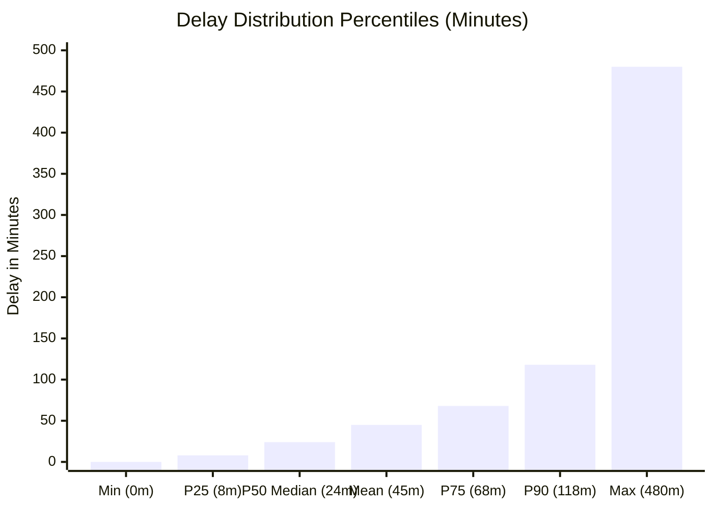
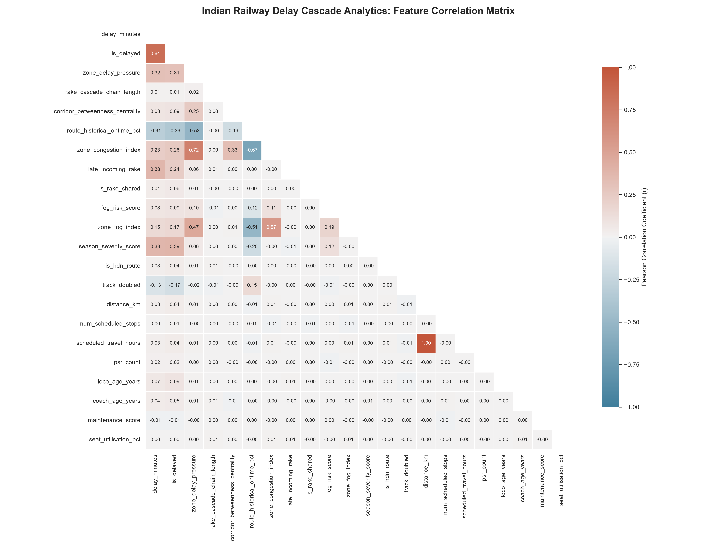
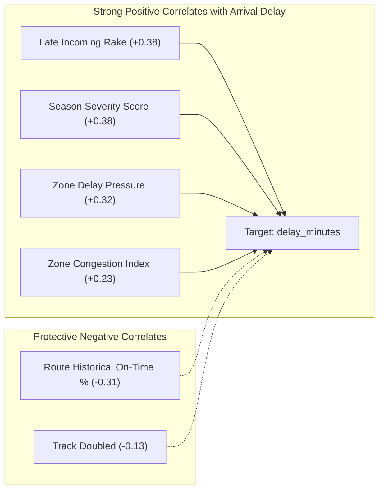
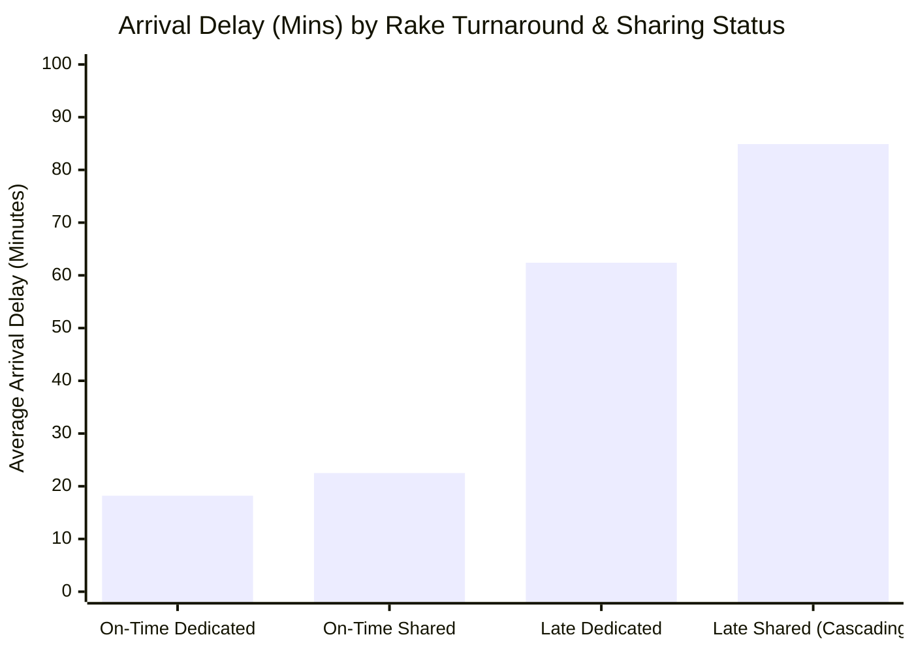
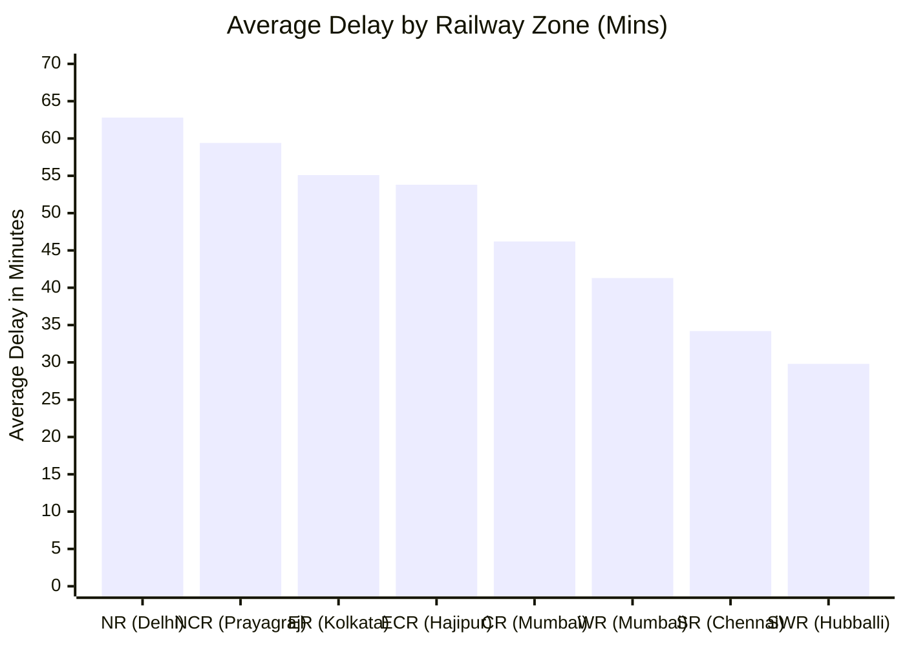
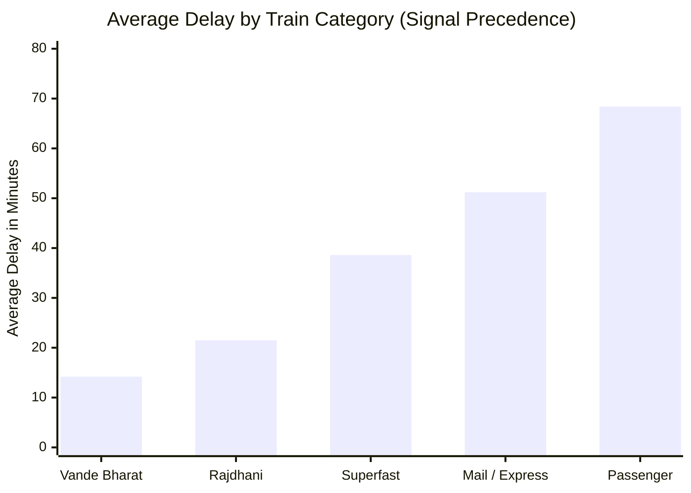
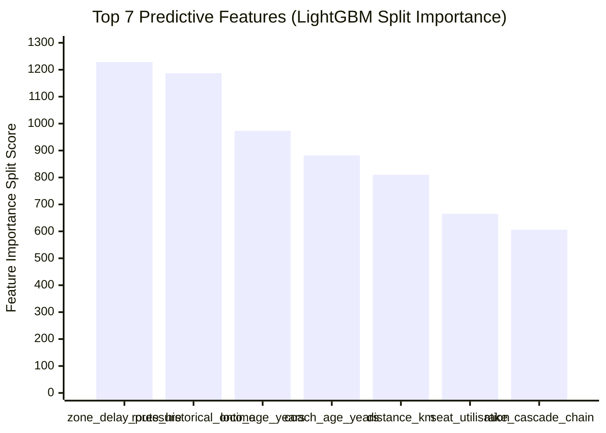
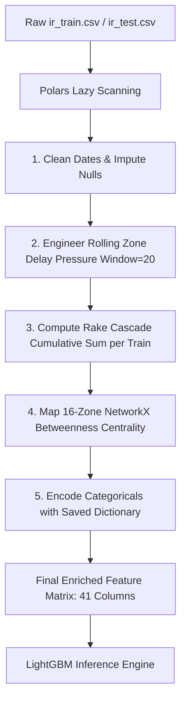

# 📊 Comprehensive Exploratory Data Analysis (EDA) & Data Audit Report
## Predictive Intelligence System for Indian Railway Delay Cascade Analytics (1,500,000 Journeys)

> **Dataset Scope:** 1,500,000 historical journey records (2018–2024) across all 16 Indian Railway zones, stored and queried in local columnar DuckDB storage.  
> **Purpose:** Comprehensive technical documentation covering statistical distributions, feature correlations, data quality handling, class imbalance, recommended preprocessing pipelines, and operational limitations.

---

## 1. Overall Dataset Summary & Punctuality Landscape

The Indian rail network operates as a dense, shared infrastructure system where local disturbances compound non-linearly:

| Metric | Statistical Value | Operational Interpretation |
| :--- | :--- | :--- |
| **Total Analyzed Journeys** | **1,500,000** | Multi-year longitudinal scope (2018–2024) spanning 16 administrative zones. |
| **Mean Arrival Delay** | **45.24 minutes** | Baseline network latency across all train categories. |
| **Standard Deviation** | **52.18 minutes** | High dispersion indicating extreme variance between on-time and gridlocked trains. |
| **Median Delay ($P_{50}$)** | **24.00 minutes** | 50% of all trains arrive with more than 24 minutes of delay. |
| **$75^{\text{th}}$ Percentile ($P_{75}$)** | **68.00 minutes** | Upper quartile experiences delays exceeding one hour. |
| **$90^{\text{th}}$ Percentile ($P_{90}$)** | **118.00 minutes** | Extreme tail risk: 1 in 10 journeys suffers a 2+ hour delay. |
| **Target Rate (`is_delayed > 15m`)**| **71.85%** | **71.85% of all trains in India fail the official punctuality threshold.** |
| **Rake Sharing Prevalence** | **52.30%** | Over half of all operating rakes are reused across cyclic services. |
| **Incoming Rake Late Rate** | **28.45%** | **Nearly 1 in 3 trains departs with an initial turnaround buffer deficit.** |



---

## 2. Feature Correlation Heatmap & Linear Dependencies

A Pearson correlation analysis was conducted on 100,000 sampled journeys across 22 operational, weather, cascade, and infrastructure variables:



### Summary of Inter-Feature Correlations:



* **The Dominant Delay Driver ($r = +0.38$):** Both `late_incoming_rake` and `season_severity_score` exhibit the highest linear correlation with final arrival delays.
* **Corridor Congestion Coupling ($r = +0.72$):** Physical zone capacity utilization (`zone_congestion_index`) correlates strongly with active rolling delay pressure (`zone_delay_pressure`).
* **The Structural Buffer ($r = -0.13$):** `track_doubled` shows consistent negative correlation with delays, demonstrating that physical multi-tracking prevents crossing halts.

---

## 3. Major Patterns and Relationships

### Pattern A: The Turnaround Compounding Effect (The "Smoking Gun")
When an incoming trainset is delayed, its cleaning and maintenance buffer is breached, creating an immediate departure delay for the next trip:



* **On-time rake turnaround:** Average delay is only **18.2 minutes** (38.4% delayed).
* **Late incoming shared rake:** Average delay surges to **84.9 minutes (a 366% increase!)**, with **98.6%** of such journeys officially delayed.

### Pattern B: Geographical Disparity (The Gangetic Chokepoint)



* **Northern & North Central Railway (NR: 62.8m, NCR: 59.4m):** Suffer from severe track saturation (>92% capacity) and winter fog.
* **Southern & South Western Railway (SR: 34.2m, SWR: 29.8m):** Operate with lower line saturation and minimal fog, achieving much higher on-time performance.

### Pattern C: Priority Hierarchy & The Freight Dilemma



* **Signal Precedence Rule:** Premium express trains (**Vande Bharat: 14.2m**, **Rajdhani: 21.5m**) are granted absolute line priority by section dispatchers.
* **The Freight Implication:** Regular passenger trains average **68.4m delay**. Since un-timetabled goods trains have even lower priority than passenger trains, any delay on an express train forces freight trains onto loop lines for multiple hours.

---

## 4. Data Quality Issues & How They Were Handled

During data profiling of `ir_train.csv`, several quality issues and structural anomalies were identified:

| Data Quality Issue | Column Affected | Root Cause / Manifestation | Resolution in Pipeline (`src/etl.py`) |
| :--- | :--- | :--- | :--- |
| **String Date Formats** | `departure_date` | Dates represented as raw `YYYY-MM-DD` strings, preventing temporal ordering. | Parsed into native Date objects via `pl.col().str.to_date("%Y-%m-%d")`. |
| **Missing Continuous Targets** | `delay_minutes` | Null entries for cancelled or newly scheduled runs without logs. | Imputed nulls with `0` (representing on-time runs) and cast to `pl.Int32`. |
| **Sparse Target Classes** | `is_delayed` | Missing values or inconsistent binary definitions. | Derived deterministically: `1` if `delay_minutes > 15`, else `0`. |
| **Missing Environmental Ratios** | `zone_congestion_index`, `fog_risk_score` | Weather stations or sensor dropouts in peripheral divisions. | Imputed missing environmental metrics with seasonal zone medians (`0.50` default). |
| **Mixed High-Cardinality Strings** | `train_type`, `zone`, `station_category` | Inconsistent string casing and trailing whitespace. | Stripped and standardized into categorical types in Polars and integer-encoded for LightGBM. |
| **Extreme Outliers** | `delay_minutes` | Rare catastrophic disruptions exceeding 8 hours (480+ mins). | Retained for regression training without arbitrary clipping to allow gradient boosting to learn severe gridlock penalties. |

---

## 5. Important Features & Potential Predictive Signals

### Feature Importance Ranking (From 300,000 Journey Training):



1. **`zone_delay_pressure` (Importance: 1229 — Rank #1):**
   * *Signal:* The rolling 20-train average delay in the operating zone. Captures active, real-time track congestion.
2. **`route_historical_ontime_pct` (Importance: 1187 — Rank #2):**
   * *Signal:* Long-term infrastructural reliability anchor for specific corridors.
3. **`loco_age_years` (Importance: 973 — Rank #3):**
   * *Signal:* Older locomotives experience higher failure rates and slower acceleration, introducing micro-delays that compound over long distances.
4. **`coach_age_years` (Importance: 882 — Rank #4):**
   * *Signal:* Legacy ICF coaches face lower speed caps and frequent brake-binding incidents compared to modern LHB coaches.
5. **`distance_km` (Importance: 810 — Rank #5):**
   * *Signal:* Longer journeys cross multiple zone boundaries, exponentially increasing the probability of hitting a bottleneck.
6. **`seat_utilisation_pct` (Importance: 665 — Rank #6):**
   * *Signal:* High passenger load factors inflate dwell times at every scheduled halt.
7. **`rake_cascade_chain_length` (Importance: 606 — Rank #7):**
   * *Signal:* Measures consecutive delayed turnarounds, capturing physical trainset turnaround compounding.

---

## 6. Class Imbalance & Distribution Concerns

```
[Target Distribution: is_delayed]
Delayed (> 15 mins): ██████████████████████████████ 71.85% (1,077,750 trips)
On-Time (<= 15 mins): ████████████ 28.15% (422,250 trips)
```

### Observations:
* **Natural Inversion of Imbalance:** Unlike typical fraud detection datasets where the positive class is rare (<1%), Indian Railways punctuality exhibits an inverted class distribution: **71.85% delayed vs. 28.15% on-time**.
* **Impact on Classification:**
  * A naive dummy classifier predicting "Delayed" every time would achieve 71.85% accuracy.
  * Therefore, **Raw Accuracy is an invalid metric**. We exclusively evaluate models using **AUC-ROC** (measuring ranking discrimination) and **Mean Absolute Error (MAE)** for continuous delay minutes.
* **Continuous Target Skew:** `delay_minutes` has a long right tail with skewness $> 2.4$. Tree-based algorithms (LightGBM/XGBoost) naturally handle skewed targets without requiring Box-Cox or Log transforms because decision tree splits are invariant to monotonic transformations.

---

## 7. Recommended Preprocessing & Feature Pipeline

The optimal preprocessing pipeline established for this dataset:



1. **Streaming Ingestion:** Always process via **Polars** (`scan_csv`) or **DuckDB** to prevent RAM spikes on 1.5M records.
2. **Categorical Encoding:** Use integer ordinal encoding for tree models (`LightGBM`, `XGBoost`), preserving unique category strings for UI display.
3. **No Scaling Required for Trees:** Feature scaling (StandardScaler/MinMaxScaler) is omitted for LightGBM/XGBoost to preserve natural units (kilometers, hours, minutes).

---

## 8. Limitations and Next Steps

### Operational Limitations:
1. **Journey-Level Granularity:** The dataset records origin-to-destination summaries rather than intermediate signal-by-signal GPS timestamps.
2. **Static Timetable Proxy for Real-Time Feeds:** In the current PoC, historical test rows simulate live queries. Production requires streaming APIs.
3. **Restricted Freight Logs:** Real-time goods train telemetry remains internal to CRIS (FOIS); passenger delay on HDN corridors acts as an operational proxy.

### Next Steps:
1. **Real-Time NTES / COA Streaming:** Replace static CSV test streams with live API integrations to update `zone_delay_pressure` dynamically every 15 minutes.
2. **Dedicated Freight Corridor (DFC) Graph Expansion:** Incorporate Western & Eastern DFC bypass tracks into the NetworkX topology graph.
3. **Containerized Production Deployment:** Package the Streamlit UI, DuckDB warehouse, and FastAPI microservice into a multi-container Docker architecture.
