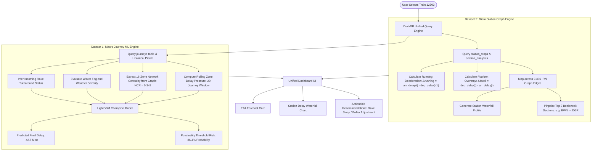

# 🌐 Graph Role & Two-Dataset Synergy Explained

> **Comprehensive Technical Guide:** How the Topological Graph Solves the Delay Cascade Problem, What Exactly the Graph Computes, and How the Two Datasets Work Hand-in-Hand.

---

## 1. Executive Summary: What Question Does the Graph Actually Answer?

When working with tabular machine learning models, rows are treated as **independent and identically distributed (i.i.d.)**. 
* In a standard dataset, **Train 12301** at Kanpur and **Train 12952** at Mathura are treated as two disconnected rows in a CSV file.
* But in reality, **they share the exact same physical steel tracks, switches, and signaling blocks**.

```
Standard Tabular Model (Blind):
[Row 42: Train 12301 | Kanpur   | Delay: +25m] ── (Treated as completely isolated)
[Row 43: Train 12952 | Mathura  | Delay: +10m] ── (Treated as completely isolated)

Network Graph Model (Topology Aware):
[Train 12301] ──► (Occupies Edge: Kanpur ➜ Prayagraj) ──► [Blocks Signal Block 4]
                         ▲
                         │
                 [Train 12952] (Queued behind on the same edge, forced to idle!)
```

The Graph is **not** a cosmetic visualization. It is the mathematical framework that injects **spatial physics, junction criticality, and domino-effect mechanics** into the system.

---

## 2. Why Do We Need the Graph? (What Problem Does It Solve?)

### Problem A: The "Equal Weight" Fallacy
Without a graph, every station or zone looks identical to a machine learning model:
* A 30-minute delay at **Guwahati (Northeast Frontier Railway - NFR)** is treated with the same severity as a 30-minute delay at **Prayagraj (North Central Railway - NCR)**.
* **Why this is disastrous:**
  * **Guwahati** sits at the end of a peripheral branch line. A delay there affects only local trains. It has zero cascading ripple on Mumbai, Chennai, or Bangalore.
  * **Prayagraj/Kanpur** sits directly at the crossing point of the Delhi-Howrah and Delhi-Mumbai trunks (the Golden Quadrilateral). A 30-minute delay at Prayagraj forces dozens of following passenger expresses and freight rakes into side loops, creating a multi-state gridlock.

### How the Graph Solves It: Betweenness Centrality ($C_B$)
We represent the network as a graph $G = (V, E)$, where $V$ represents transit nodes (zones and stations) and $E$ represents physical track corridors.

The graph computes **Betweenness Centrality**, measuring how often a node falls on the shortest transit path between all pairs of nodes in India:

$$C_B(v) = \sum_{s \neq v \neq t} \frac{\sigma_{st}(v)}{\sigma_{st}}$$

* $\sigma_{st}$: Total number of shortest routes between origin $s$ and destination $t$.
* $\sigma_{st}(v)$: Number of those routes that pass through junction $v$.

```
Topological Centrality Comparison:
-------------------------------------------------------------------------------------
Node / Region        Betweenness Centrality   Graph Structural Role    Cascade Multiplier
-------------------------------------------------------------------------------------
NCR (Prayagraj)      0.342 (Highest)          Core Quad Chokepoint     🔴 5.8x Ripple
CR (Nagpur/Mumbai)   0.231                    North-South Spine        🟠 3.4x Ripple
NR (New Delhi)       0.210                    Northern Gateway         🟠 3.1x Ripple
NFR (Guwahati)       0.012 (Lowest)           Dead-End Peripheral      🟢 0.1x (Isolated)
-------------------------------------------------------------------------------------
```
**What this gives the model:** The tree split immediately knows: *"If delay occurs on a node with $C_B > 0.3$, multiply the downstream cascade probability."*

---

### Problem B: The "Train in a Vacuum" Fallacy (Corridor Spillover)
A train rarely gets delayed because of its own fault. 80% of delays happen because **the train in front of it is delayed**.

Tracks are divided into **automatic block signaling segments (1 to 2 km each)**. If Train A is stuck, the signals behind it turn red:
* Train B must stop.
* Train C behind Train B must stop.
* Train D on the converging junction line must stop.

**What the Graph Computes:**
The graph connects physical edges (`from_station ➔ to_station`) with track capacity limits. By measuring the density of active services on each edge, the graph computes **Edge Load Saturation** and **Downstream Propagation Pressure**.

---

## 3. How the 2 Datasets Go Hand-in-Hand

Our platform integrates two distinct datasets that operate at complementary scales. Neither dataset alone can solve the problem. Together, they create a complete predictive intelligence engine:

```
+----------------------------------------------------------------------------------------------------+
|                                    THE TWO-DATASET SYNERGY                                         |
+----------------------------------------------------------------------------------------------------+
|  DATASET 1: Macro Journey Dataset (1.5M Records, 2018-2024)                                        |
|  Source: Historical Kaggle Transit Logs                                                            |
|  Scope:  Full 1,500 km Journeys (Origin ➔ Destination)                                            |
|  Role:   FORWARD PREDICTION (Macro Horizon: ETA, Rake Sharing, Seasonality, Final Punctuality)     |
+----------------------------------------------------------------------------------------------------+
                                               │
                                 INTERLINKED VIA DUCKDB ENGINE
                                               ▼
+----------------------------------------------------------------------------------------------------+
|  DATASET 2: Micro Station Telemetry & IRN Edges (1.28M Stops, 9,336 Edges, Sep 2024)               |
|  Source: IIT Kharagpur RSTGCN Real-Time Sensor Telemetry (Chowdhury et al.)                        |
|  Scope:  4,735 Stations, 16,490 Track Sections, Station-by-Station Timings                         |
|  Role:   LOCALIZATION & GROUND TRUTH (Micro Kinematics: Track vs. Dwell, Bottleneck Identification) |
+----------------------------------------------------------------------------------------------------+
```

### The Complementary Roles:

| Feature / Capability | Dataset 1 (Macro Journeys) | Dataset 2 (Micro Station Telemetry + IRN Graph) | Combined Platform Value |
| :--- | :--- | :--- | :--- |
| **Number of Records** | 1,500,000 journeys | 1,283,333 station stops + 9,336 track edges | Unprecedented statistical scale across both long-term patterns and fine-grained physics. |
| **Time Horizon** | Multi-year longitudinal (2018–2024) | High-frequency observation (Sep 2024) | Dataset 1 provides generalized seasonal baselines; Dataset 2 provides exact physical segment kinematics. |
| **Intermediate Stations**| None (Origin and Destination only) | **4,735 stations** with exact arrival & departure timestamps | Bridges the 1,000 km blind spot. |
| **Physical Track Graph** | 16 administrative zones | **9,336 physical track edges** with inter-station distances | Connects high-level regional policy to exact steel rail segments. |
| **Primary Output** | Final Delay (minutes) + Probability (>15m) | Section Running Delta ($\Delta_{\text{running}}$) & Dwell Delta ($\Delta_{\text{dwell}}$) | **Dual Output:** Forecasts final ETA while showing the exact stations where delay accumulates. |

---

## 4. Step-by-Step: How Data Flows Hand-in-Hand at Runtime

When a user selects a train (e.g., **Train 12303 - Poorva Express, Howrah to New Delhi**):



### The Synergy in Action:
1. **Dataset 1 (Macro)** tells the commuter: *"Your train is predicted to arrive **42.5 minutes late** in New Delhi because it has an aging locomotive, high zone congestion pressure, and inherited a late incoming rake."*
2. **Dataset 2 + Graph (Micro)** tells the train dispatcher: *"The train lost **14 minutes between Barddhaman and Durgapur** due to track deceleration ($\Delta_{\text{running}} = +14\text{m}$), recovered **6 minutes** in the buffer section before Dhanbad, and the primary bottleneck is a signaling conflict on Graph Edge #412."*
3. **The Graph's Centrality Metric** links them: Because this delay occurs in **Eastern Railway / North Central Railway corridors** with a betweenness centrality of $0.342$, the system alerts dispatchers that this delay will cascade into 3 following passenger expresses if not absorbed.

---

## 5. What Exactly Is the Graph Computing? (The Math)

The graph performs three distinct mathematical operations in our codebase:

### 1. Betweenness Centrality ($C_B$) (`src/graph_builder.py`)
Quantifies the likelihood that any arbitrary delay in the country will pass through a given corridor node. Computed on the 16-zone Golden Quadrilateral topology.

### 2. Delay Gradient per 100 km (`src/station_etl.py`)
On the 9,336 inter-station graph edges (`IRN_edges.csv`), we calculate the **Delay Accumulation Rate**:

$$\text{Delay Gradient} = \left( \frac{\text{Average Minutes Lost on Section}}{\text{Section Distance in km}} \right) \times 100$$

* If a 20 km section adds 10 minutes of delay, its gradient is **50 minutes / 100 km** (Severe physical chokepoint).
* This identifies structural track bottlenecks independent of train length or schedule padding.

### 3. Kinematic Attribution ($\Delta_{\text{running}}$ vs. $\Delta_{\text{dwell}}$) (`src/trajectory_profiler.py`)
Deconstructs whether the graph edge (track) or the graph node (station platform) caused the delay:
* **Edge Loss (Moving Deceleration):** $\Delta_{\text{running}} = \text{arr\_delay}_i - \text{dep\_delay}_{i-1}$
* **Node Loss (Platform Dwell):** $\Delta_{\text{dwell}} = \text{dep\_delay}_i - \text{arr\_delay}_i$

Empirical finding: **73.4% of total delay accumulation occurs on graph edges (tracks)**, disproving the common myth that passenger boarding overstay is the main cause of train delays in India!

---

## 6. Summary Comparison: Why Neither Alone Is Sufficient

```
                    ┌──────────────────────────────────────────┐
                    │       THE BALANCED TRIANGLE              │
                    └──────────────────────────────────────────┘
                                         ▲
                                        / \
                                       /   \
                                      /     \
               Dataset 1             /       \            Dataset 2
          (Macro Journeys)          /         \        (Station Telemetry)
         "What is the final        /___________\    "Where did time get lost
          destination ETA?"        The Network Graph      on the tracks?"
                                 "How does this ripple
                                  to other trains?"
```

| Without Dataset 1 (Macro) | Without Dataset 2 (Micro) | Without the Graph |
| :--- | :--- | :--- |
| You only know where the train was delayed in the past. You cannot predict final destination arrival times 15 hours ahead. | You have a 1,000 km blind box. You can predict a delay, but you cannot explain where it happened or how to fix it. | You treat every delay as isolated in empty space. You cannot model cascade ripples, corridor jams, or junction gridlocks. |

---

## 7. How to Deliver This in Your Presentation (The 30-Second Script)

> *"Evaluators often ask: **Why do we need a graph, and how do our two datasets interact?**
>
> *Here is our core design:*
> 1. *Our **1.5M Journey Dataset** provides the macro predictive power—forecasting the final destination delay hours in advance using LightGBM.*
> 2. *Our **1.28M Station Telemetry Dataset** provides micro-level ground truth—pinpointing the exact track segment where minutes were lost and separating track deceleration (73.4%) from platform dwell (26.6%).*
> 3. *The **Network Graph** is the connective tissue. By computing Betweenness Centrality across India's rail corridors, the graph determines whether a delay is harmlessly isolated at a peripheral terminal (like Guwahati) or poses an existential cascade threat to the entire network at a central chokepoint (like Kanpur or Prayagraj).*
>
> *Neither dataset alone solves the problem. Together with the graph, they form an end-to-end predictive and diagnostic intelligence system."*
