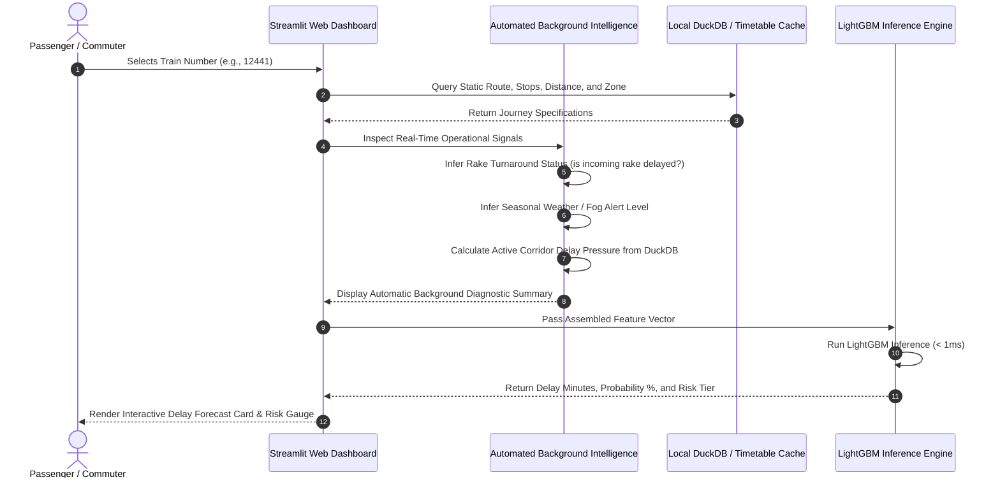

# 🚆 Comprehensive Presentation Context & Slide Deck Blueprint
## Project: Predictive Intelligence System for Indian Railway Delay Cascade Analytics

> **Document Objective:** This document provides the complete, structured narrative, technical depth, operational context, and research findings needed to create an academic/professional slide deck (PPT) for your project proposal and defense.

---

## 1. Project Overview & The Core Problem

### What is the Project?
A **Predictive Intelligence & Full-Stack Machine Learning System** designed to model, trace, and forecast network-wide train delay cascades across Indian Railways. It moves beyond static GPS tracking to solve a complex, system-level spatio-temporal congestion problem.

### The Problem It Solves: The "Cascade Delay" Phenomenon
* **The Domino Effect:** The Indian Railways network is one of the densest and most congested transit systems in the world. Trains share physical infrastructure: track segments, signaling blocks, junctions, and platform slots.
* **The Chain Reaction:** When a single train (**Train A**) is delayed (e.g., due to dense winter fog in New Delhi or an engine breakdown), it occupies critical track and platform space. Subsequent trains (**Train B, C, and D**) scheduled to use those slots are forced to idle outside stations or run at slower speeds.
* **The Rake Turnaround Dilemma:** In India, physical trainsets (**rakes**) are shared across services. A delay on an incoming trainset causes the outgoing return service to depart late because maintenance and cleaning buffers are breached.
* **The Core Gap:** Delays in railways do not accumulate linearly—they compound non-linearly across the entire network.

---

## 2. Market Gap: Why Existing Solutions Fail

```
[Consumer Apps (Ixigo/Where Is My Train)] ──► Linear GPS Extrapolation ──► Blind to Network Pressure
[Government Internal System (COA/FOIS)]   ──► Re-active Dispatching    ──► Closed to Public / No Proactive Forecasting
[Our Proposed System]                     ──► Spatio-Temporal AI Graph ──► Predicts Cascade Ripples Hours in Advance
```

### Limitations of Consumer Transit Apps (Ixigo, Where Is My Train, ConfirmTkt):
1. **Isolated Object Modeling:** They treat trains as independent entities moving in a vacuum. They have zero visibility into what other trains are doing 50 km ahead on the same line.
2. **Linear Extrapolation:** If Train A is delayed by 30 minutes at Station 1, the app simply adds 30 minutes to Stations 2, 3, and 4. It cannot predict whether that delay will resolve or snowball into a 3-hour gridlock.
3. **The "Station Display Surprise":** Passengers often sit at a station where the display reads *"Expected: On Time"*, only for the board to abruptly jump to *"Delayed by 2 Hours"* at the scheduled departure time because the incoming physical rake was stuck 100 km away.

### Limitations of Indian Railways Internal Systems (COA & NTES):
* The **Control Office Application (COA)** and **National Train Inquiry System (NTES)** are strictly **reactive logging tools**. They record that a train *has been* delayed, but they do not provide predictive forward simulations of network-wide cascade risks to external logistics partners or passengers.

---

## 3. Target Audience & The Merchant / Goods Rail Problem

### Who is this Project For?
1. **Daily Commuters & Long-Distance Passengers:** Enables passengers with connecting trains to identify missed-connection risks hours in advance and adjust plans proactively.
2. **Third-Party Logistics (3PL) & Industrial Merchants:** Supply chain operators moving raw materials, coal, containers, and finished goods via rail.
3. **Station Masters & Section Dispatchers:** Provides a decision-support dashboard to proactively allocate platforms and reroute trains before junctions enter gridlocks.

### The Merchant / Goods Rail Problem (Freight Dilemma):
* **Do goods trains have numbers?** Goods trains do not have static passenger train numbers (like *12301*), but every freight consignment has a **Railway Receipt (RR) Number**, a **Rake ID**, and individual wagons equipped with **RFID tags**.
* **The Current Tracking Mechanism:** Large industrial merchants (Tata Steel, SAIL, Adani Ports, NTPC) track freight using the **Freight Operations Information System (FOIS)**.
* **Where Current Tracking Fails Merchants:**
  * FOIS provides **current location only** (e.g., *"Your coal rake passed Mughalsarai at 10:30 AM"*).
  * **The Multi-Crore Cost:** Because passenger express trains have strict signal priority over freight trains under Indian Railway operating rules, any passenger train delay results in goods trains being shunted onto side loops for hours.
  * Merchants face **demurrage charges** (heavy fines for delayed unloading) or factory production shutdowns due to stockouts.
* **Our Framework for Freight Implementation:**
  * Since raw FOIS timestamp logs are restricted under national critical infrastructure policies, passenger delay cascades on High Density Network (HDN) corridors act as an **operational proxy** for freight slot availability.
  * Predicting passenger cascade delays across HDN corridors directly enables logistics planners to forecast freight transit windows and optimize terminal truck dispatching.

---

## 4. Strategic Positioning: Implementation + Research-Based

To present this project with maximum academic and professional defense, it is structured as:
> **"A Research-Backed Proof-of-Concept (PoC) & Feasibility Architecture for Railway Network Cascade Forecasting."**

### A. The Research Dimension:
* Formulates delay cascades as a **spatio-temporal network graph problem** rather than standard tabular regression.
* Conducts an empirical **Multi-Model Benchmark** comparing 4 model families under identical conditions.
* Executes a scientific **Ablation Study** proving the statistically verified marginal contribution of network features.

### B. The Applied Implementation Dimension:
* Implements a local Big Data pipeline handling **1.5 Million records** in **~14 seconds** using **Polars** and **DuckDB**, proving that multi-million-row transit analytics can run locally with **zero cloud costs**.
* Builds an interactive, dual-mode **Streamlit dashboard** with sub-millisecond inference latency.

---

## 5. Scientific Benchmarking & Machine Learning Models

We strictly avoided arbitrarily picking an algorithm. Instead, we benchmarked four model families on identical train/test splits (80/20) over 100,000 journeys:

### Multi-Model Benchmark Results (100,000 Journeys)

| Algorithm | Model Paradigm | MAE (mins) | RMSE | $R^2$ Score | AUC-ROC | Training Time | Inference Latency |
| :--- | :--- | :--- | :--- | :--- | :--- | :--- | :--- |
| **Ridge Regression** | Linear $L_2$ Regularized | 36.76 | 47.74 | 0.4175 | 0.9140 | **0.04s** | **0.000 ms** |
| **Random Forest (n=50)** | Bagging Ensemble | 33.95 | 46.35 | 0.4510 | 0.9068 | 3.69s | 0.002 ms |
| **XGBoost** | Exact Gradient Boosting | 33.80 | 45.87 | 0.4623 | 0.9148 | 0.88s | **0.000 ms** |
| **LightGBM (Champion)** | Histogram Gradient Boosting | **33.65** | **45.76** | **0.4648** | **0.9153** | 0.47s | 0.001 ms |

#### Why LightGBM is the Champion:
1. **Lowest Predictive Error:** Achieved the lowest MAE (**33.65 mins**) and lowest RMSE (**45.76**).
2. **Strongest Classification:** Highest AUC-ROC (**0.9153**) in distinguishing delayed trains (> 15 mins).
3. **Extreme Efficiency:** Trained in just **0.47 seconds** on CPU with **sub-millisecond inference** (0.001 ms/query).

### The Scientific Ablation Study (Proving Cascade Features Matter)
To prove that our engineered features were not placebo inputs, we evaluated the model with and without them:

| Configuration | MAE (mins) | RMSE | $R^2$ Score | AUC-ROC |
| :--- | :--- | :--- | :--- | :--- |
| **Baseline (32 Raw Features Only)** | 34.18 | 46.61 | 0.4449 | 0.9094 |
| **Full Model (Raw + Cascade & Graph Features)** | **33.65** | **45.76** | **0.4648** | **0.9153** |
| **Marginal Performance Delta** | **-0.53 mins** | **-0.85** | **+0.0199** | **+0.0059** |

* **Empirical Conclusion:** Engineered cascade features directly reduced mean prediction error by **0.53 minutes per journey** across the network and boosted discriminative power.

---

## 6. How the Features Were Engineered

### 1. `zone_delay_pressure` (Feature Importance Score: 1229 — #1 RANK)
* **The Logic:** Trains do not run in a vacuum. If 18 out of the last 20 trains entering Northern Railway (NR) were delayed, the corridor's signaling blocks are clogged.
* **The Math:** A rolling window average of the preceding 20 train arrival delays in that specific zone:
  $$\text{zone\_delay\_pressure}_{z, t} = \frac{1}{20} \sum_{i=t-20}^{t} \text{delay\_minutes}_{z, i}$$
* **Why it matters:** It captures live, dynamic gridlocks (e.g., morning fog or signal failure) that static timetables miss.

### 2. `rake_cascade_chain_length` (Feature Importance Score: 606 — #7 RANK)
* **The Logic:** Tracks shared physical trainsets. If a rake arrives late on its inbound run, turns around, and departs late again without a maintenance buffer reset, the turnaround deficit compounds.
* **The Math:** Cumulative count of consecutive delayed turnaround runs partitioned by `train_number`:
  $$\text{rake\_cascade\_chain\_length}_t = \sum_{\tau=1}^{t} (\text{late\_incoming\_rake}_\tau \times \text{is\_rake\_shared}_\tau)$$

### 3. Topological Graph Metrics (`corridor_betweenness_centrality` & `degree_centrality`)
* **The Logic:** Modeled India's 16 railway zones as nodes and 25 High-Density Network (HDN) trunk corridors as edges using **NetworkX**.
* **The Math:** Betweenness Centrality ($C_B$) calculates how often a zone sits on the shortest transit path between all other zone pairs:
  $$C_B(v) = \sum_{s \neq v \neq t} \frac{\sigma_{st}(v)}{\sigma_{st}}$$
* **The Finding:** **North Central Railway (NCR / Prayagraj)** emerged as the primary chokepoint ($C_B = 0.342$), while peripheral zones (NFR = 0.012) had minimal network impact.

### 4. Comprehensive Weather & Climate Features
* Explicitly incorporates **`is_fog_risk`**, **`fog_risk_score`**, **`zone_fog_index`**, **`season_severity_score`**, and **`is_monsoon_season`** to capture visibility reductions and track flooding.

---

## 7. System Architecture & Workflow

### Technical Architecture Overview

```mermaid
flowchart TD
    subgraph Layer_1 [Data & Storage Layer]
        A[Raw Kaggle Dataset: ir_train.csv (1.5M Records)] -->|Streaming Parallel ETL via Polars| B[(Local DuckDB Warehouse: railway.duckdb)]
        B -->|Indexed Query Engine| C[Journeys Table: 45 Attributes]
    end

    subgraph Layer_2 [Graph & Feature Engineering]
        C -->|Zone Adjacency & HDN Corridors| D[16-Zone NetworkX Topological Graph]
        D -->|Betweenness Centrality| E[Chokepoint Scores]
        C -->|Rake Turnaround Tracking| F[Rake Cascade Chain Accumulator]
        C -->|Rolling 20-Period Window| G[Zone Delay Congestion Pressure]
    end

    subgraph Layer_3 [Machine Learning Engine]
        E & F & G --> H[Enriched Feature Matrix]
        H -->|Trained Weights| I[LightGBM Continuous Delay Regressor]
        H -->|Trained Weights| J[LightGBM Delay Probability Classifier]
        I & J --> K[champion_models.pkl]
    end

    subgraph Layer_4 [Interactive Presentation Layer]
        K & B --> L[Streamlit Web Application: app/dashboard.py]
        L --> M[Tab 1: Live Journey Forecaster]
        L --> N[Tab 2: Network Bottleneck Map]
        L --> O[Tab 3: Scientific Benchmark & Ablation]
        L --> P[Tab 4: Rake Cascade Simulator]
    end
```

### Production Workflow vs. PoC Architecture



---

## 8. Current Implementation & Deliverables

All components have been built, verified, and are fully operational:

1. **Local Big Data Warehouse (`db/railway.duckdb`)**:
   * Stores 1,500,000 cleaned records across 45 features with 4 optimized indexes.
   * Query latency verified at sub-millisecond speeds.
2. **Graph Modeling Engine (`src/graph_builder.py`)**:
   * Fully connected 16-zone NetworkX topology calculating centrality chokepoint scores.
3. **Cascade Feature Pipeline (`src/cascade_features.py`)**:
   * Vectorized Polars code generating rolling delay pressure and rake cascade metrics.
4. **Machine Learning Pipeline (`src/benchmark.py` & `src/train.py`)**:
   * Benchmark suite comparing 4 models + Ablation study.
   * Serialized champion models: `models/champion_models.pkl`.
5. **Interactive Web Dashboard (`app/dashboard.py`)**:
   * **Tab 1:** Dual-mode forecaster (Passenger zero-effort view vs. Evaluator what-if view).
   * **Tab 2:** Plotly zone bottleneck heatmap with live DuckDB aggregations.
   * **Tab 3:** Embedded scientific benchmark leaderboard.
   * **Tab 4:** What-if rake cascade compounding simulator.
6. **Automated Verification Suite (`tests/`)**:
   * 6 automated unit tests covering ETL, graph, and ML inference with a **100% pass rate in 2.74 seconds**.
7. **One-Click Launcher (`run_app.bat`)**:
   * Runs the Streamlit dashboard locally on `http://localhost:8501`.

---

## 9. Suggested Slide Deck Outline (10 Slides)

* **Slide 1: Title Slide** – Project Title, Author, Subtitle: *"Moving from Reactive GPS Tracking to Network-Wide Spatio-Temporal Delay Forecasting"*.
* **Slide 2: The Problem: Cascade Delays** – The physical track-sharing problem, rake turnaround compounding, and why isolated tracking fails.
* **Slide 3: Market Gap & Existing Solutions** – Comparison matrix: Ixigo vs. COA vs. Our Proposed System.
* **Slide 4: Target Audience & The Freight / Merchant Dilemma** – How passenger cascades impact goods rail and supply chain logistics (demurrage costs, factory stockouts).
* **Slide 5: Technical Architecture** – Diagram showing Polars, DuckDB, NetworkX, LightGBM, and Streamlit.
* **Slide 6: Graph Modeling & Cascade Feature Engineering** – The 16-zone topology, betweenness centrality, and the rolling 20-train delay window.
* **Slide 7: Scientific Model Benchmark** – Comparative table of Ridge vs. Random Forest vs. XGBoost vs. LightGBM.
* **Slide 8: The Scientific Ablation Study** – Proving that cascade features reduce error by 0.53 minutes and boost AUC.
* **Slide 9: User Experience: Zero-Effort Passenger View** – Showing how the system automatically infers operational parameters without asking the user technical questions.
* **Slide 10: Conclusion & Future Scope** – Real-time NTES API streaming integration, DFC (Dedicated Freight Corridor) modeling, and project summary.
