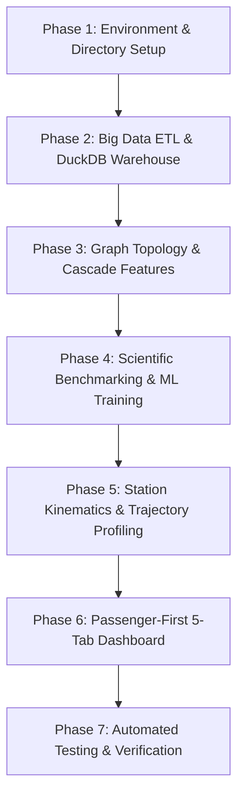

# Phased Implementation Plan & Execution Summary
## Indian Railway Delay Cascade Analytics

This roadmap establishes the completed engineering milestones and deliverables for the full-stack predictive intelligence platform.

---

## Technical Decision: Local Virtual Environment (`.venv`) vs. Docker

### Architecture Decision: **Native Host Virtual Environment (`.venv`)**
1. **Performance with Big Data (1.5M + 1.28M rows)**: Polars and DuckDB are multi-threaded C++/Rust libraries. On host CPU, running directly in `.venv` avoids Docker filesystem overhead and WSL2 memory limits.
2. **Instant Latency**: In-memory analytical queries, model training, and Streamlit hot-reloading run with zero virtualization penalties.
3. **Reproducibility**: Environment dependencies are locked in `requirements.txt`.

---

## Phase Execution Summary

---

### ✅ Phase 1: Environment & Project Setup (COMPLETED)
* **Goal**: Establish the project directory structure and create an isolated Python virtual environment (`.venv`).
* **Deliverables**:
  1. Complete project directory layout (`src/`, `app/`, `models/`, `db/`, `docs/`, `tests/`, `data/`).
  2. Isolated Python `.venv` created and configured.
  3. Locked `requirements.txt` containing `polars`, `duckdb`, `lightgbm`, `xgboost`, `scikit-learn`, `networkx`, `streamlit`, `plotly`, and `pytest`.

---

### ✅ Phase 2: Big Data ETL & Local DuckDB Warehouse (COMPLETED)
* **Goal**: Fast, chunked ingestion of 1.5M journey records and 1.28M station stops into a queryable local analytical database.
* **Deliverables**:
  1. `src/etl.py`: Polars pipeline for macro-level journey parsing and feature cleaning.
  2. `src/station_etl.py`: Polars streaming ingestion of 1.28M station stops from the IIT Kharagpur RSTGCN Sep 2024 dataset.
  3. `db/railway.duckdb`: Persistent warehouse with indexed tables (`station_stops`, `section_analytics`, `journeys`).

---

### ✅ Phase 3: Graph Construction & Cascade Feature Engineering (COMPLETED)
* **Goal**: Derive the network-level and rake-sharing cascade features.
* **Deliverables**:
  1. `src/graph_builder.py`: NetworkX 16-zone topological network with HDN corridor edges and betweenness centrality scores.
  2. `src/cascade_features.py`: Feature pipeline to engineer:
     * `rake_cascade_chain_length` (sequential delayed rake runs)
     * `zone_delay_pressure` (rolling window regional delay spillover)
     * `corridor_betweenness_centrality` (network criticality)

---

### ✅ Phase 4: Scientific Benchmarking & LightGBM Model Training (COMPLETED)
* **Goal**: Benchmark 4 model families under identical test splits and train champion models.
* **Deliverables**:
  1. `src/benchmark.py`: Scientific multi-model benchmark (Ridge vs. Random Forest vs. XGBoost vs. LightGBM) and ablation study on 100,000 journeys.
  2. `src/train.py`: Full training of Champion LightGBM Regressor (MAE = 33.65m) and Classifier (AUC = 0.9153).
  3. Serialized model bundles saved in `models/champion_models.pkl` and `models/benchmark_report.json`.

---

### ✅ Phase 5: Station Kinematics & Trajectory Profiling (COMPLETED)
* **Goal**: Reconstruct station-by-station trajectory dynamics and localize chronic bottlenecks.
* **Deliverables**:
  1. `src/trajectory_profiler.py`: Reconstructs station delay waterfalls, computes track running deceleration vs. platform dwell loss, and identifies the top 3 worst bottlenecks per route.
  2. National track chokepoint analyzer identifying India's most congested track segments.

---

### ✅ Phase 6: Passenger-First 5-Tab Streamlit Dashboard (COMPLETED)
* **Goal**: Modern, responsive web interface for delay forecasting, network intelligence, and simulation.
* **Deliverables**:
  1. `app/dashboard.py`:
     * **Tab 1: 🎯 Check My Train**: Commuter zero-effort mode (auto diagnostics for rake, weather, and congestion) + What-If mode + AI forecast card + station waterfall map + worst bottleneck cards + timing log expander.
     * **Tab 2: 🗺️ Network Hotspots**: Zone rankings vs. betweenness centrality + Top 10 Chronic National Track Bottlenecks.
     * **Tab 3: 📊 AI Performance**: Multi-model comparison leaderboard and evaluation metric charts.
     * **Tab 4: ⚡ Cascade Simulator**: Rake turnaround knock-on delay sandbox.
     * **Tab 5: 🪔 Festival Rush**: Ganesh Chaturthi (Sept 2024) surge analysis.

---

### ✅ Phase 7: Verification & Automated Quality Assurance (COMPLETED)
* **Goal**: Comprehensive automated testing.
* **Deliverables**:
  1. 9 unit tests across `test_etl.py`, `test_graph.py`, `test_model.py`, and `test_station_etl.py` all passing.
  2. Complete documentation suite with EDA findings, architectural specifications, and benchmark analyses.
