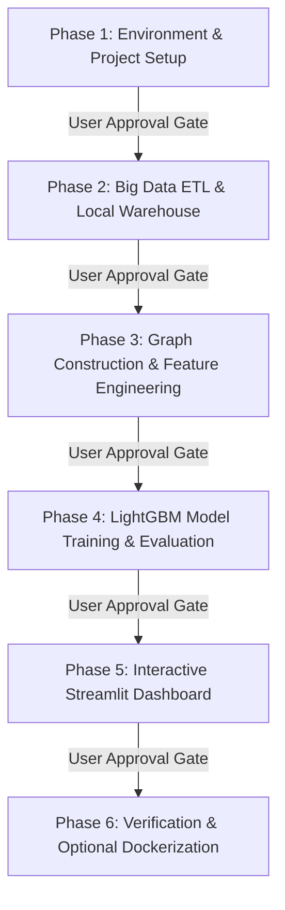

# Phased Implementation Plan: Indian Railway Delay Cascade Analytics

This roadmap establishes a step-by-step implementation process. Each phase must be reviewed and approved by you before execution begins.

---

## Technical Decision: Docker vs. Local Virtual Environment (`venv`)

### Recommendation: **Local Virtual Environment (`venv`) for Development**
For this project, **a dedicated local Python virtual environment (`venv`) is preferred for development and testing**, with an optional lightweight Docker setup at the end.

#### Why `venv` is best for this workflow:
1. **Performance with Big Data (1.5M rows)**: Polars and DuckDB are heavily multi-threaded C++/Rust libraries. On Windows, running them directly on the host CPU in a `venv` avoids Docker filesystem overhead and WSL2 memory virtualization limits.
2. **Fast Iteration**: Training models, running tests, and debugging Streamlit live reloads are much faster in a native `venv`.
3. **Hardware Accessibility**: Requires zero Docker Desktop background resource usage.

> [!TIP]
> **Plan**: We will build and test everything in a clean, isolated `.venv` first. Once the pipeline and Streamlit dashboard are fully working, we can provide a `Dockerfile` and `docker-compose.yml` so you have the option to containerize it for deployment or submission.

---

## Proposed Phases & Approval Gates

---

### Phase 1: Environment & Project Setup (FIRST STEP)
* **Goal**: Establish the project directory structure and create an isolated Python virtual environment (`.venv`).
* **Deliverables**:
  1. Create directory structure under `Indian railway/`:
     * `Indian railway/src/` (core code)
     * `Indian railway/app/` (Streamlit UI)
     * `Indian railway/models/` (model artifacts)
     * `Indian railway/db/` (DuckDB storage)
     * `Indian railway/tests/` (unit tests)
  2. Create isolated `.venv` in the project root.
  3. Create `requirements.txt` with locked versions (`polars`, `duckdb`, `lightgbm`, `streamlit`, `networkx`, `scikit-learn`, `plotly`).
  4. Install all dependencies inside `.venv` and verify Python/package compatibility.

---

### Phase 2: Big Data ETL & Local Warehouse (Polars + DuckDB)
* **Goal**: Fast, chunked ingestion of `ir_train.csv` (1.5M rows) into a queryable local analytical database.
* **Deliverables**:
  1. `src/etl.py`: Polars pipeline for data validation, missing value imputation, and timestamp parsing.
  2. `db/railway.duckdb`: Persistent local warehouse with indexed tables on `zone`, `train_number`, and `departure_date`.
  3. Verification script to confirm fast SQL querying (<100ms) on 1.5M records.

---

### Phase 3: Graph Construction & Cascade Feature Engineering
* **Goal**: Derive the network-level and rake-sharing cascade features.
* **Deliverables**:
  1. `src/graph_builder.py`: NetworkX 16-zone topological network with HDN corridor edges and centrality scores.
  2. `src/cascade_features.py`: Polars feature pipeline to engineer:
     * `rake_cascade_chain_length` (sequential delayed rake runs)
     * `upstream_zone_delay_pressure` (rolling window delay spillover)
     * `corridor_betweenness_centrality` (network criticality)
  3. Output: Clean, enriched training dataset with engineered features.

---

### Phase 4: LightGBM Model Training & Evaluation
* **Goal**: Train and validate the predictive AI models.
* **Deliverables**:
  1. `src/train.py`: Train two complementary models:
     * **LightGBM Regressor**: Predicts continuous `delay_minutes`.
     * **LightGBM Classifier**: Predicts probability of `is_delayed` (> 15 mins).
  2. Evaluation metrics: AUC-ROC, MAE, RMSE, and feature importance analysis (confirming the value of engineered cascade features).
  3. Save serialized models in `models/`.

---

### Phase 5: Interactive Web Application (Streamlit Dashboard)
* **Goal**: A user-friendly web interface for real-time predictions and network exploration.
* **Deliverables**:
  1. `app/dashboard.py`:
     * **Tab 1: Live Journey Forecaster**: User enters train/route details (or selects from `ir_test.csv`) to get instant delay predictions and risk factor breakdowns.
     * **Tab 2: Network Bottleneck Map**: Interactive zone-level topology heatmap showing active congestion and delay diffusion risk.
     * **Tab 3: Rake Cascade Simulator**: Interactive toggle showing how an incoming rake delay causes knock-on delays.

---

### Phase 6: System Verification & Optional Docker Packaging
* **Goal**: Comprehensive automated testing and containerization.
* **Deliverables**:
  1. Automated test suite (`pytest tests/`) validating ETL, graph construction, and model inference.
  2. Optional `Dockerfile` + `docker-compose.yml` for one-command container deployment.
  3. Project README and presentation guide.

---

## Next Action: Awaiting Approval for Phase 1

To proceed, please approve starting with **Phase 1: Environment & Project Setup** (creating `.venv`, folder structure, and installing dependencies).
